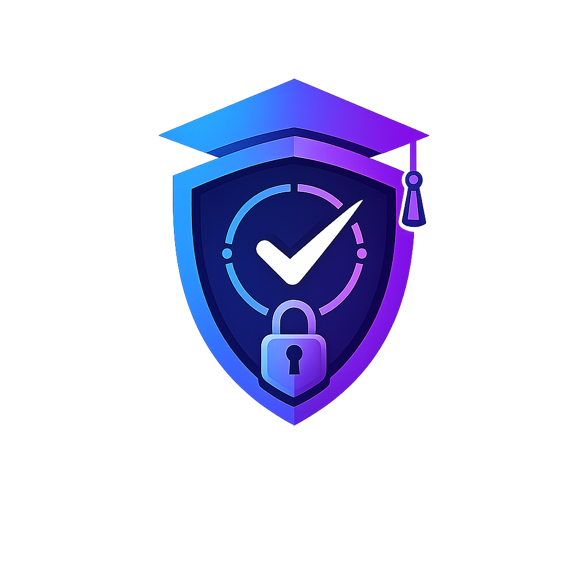
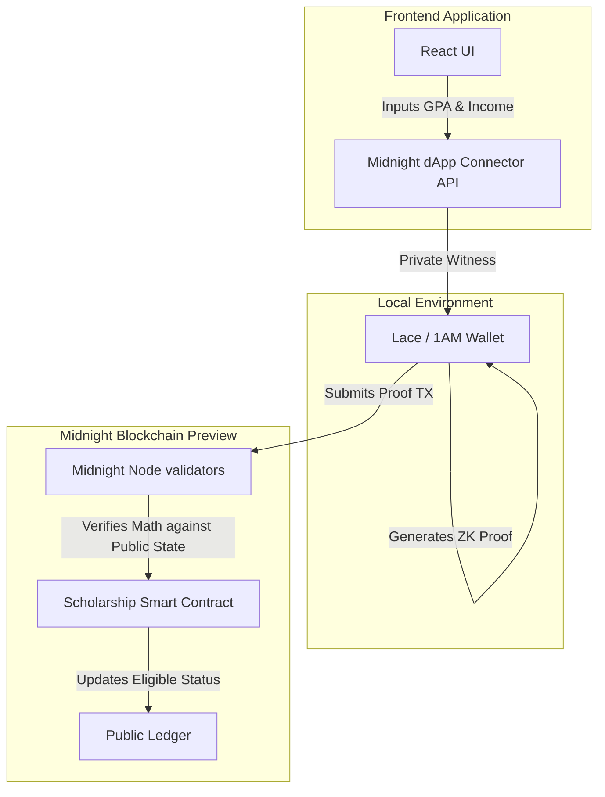
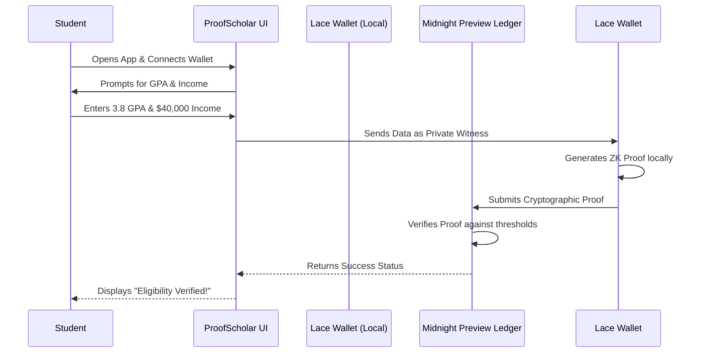

<div align="center">
  <!-- LOGO IMAGE -->
  

  <h1>ProofScholar 🛡️</h1>
  <p><strong>Privacy-Preserving Scholarship Verification on the Midnight Network</strong></p>

  <!-- TECH STACK BANNERS -->
  <p>
    
    
    
    
  </p>
</div>

---

## 🚀 Live Links

- **Live Application (Vercel):** [https://proofscholar-midnight.vercel.app/](https://proofscholar-midnight.vercel.app/)
- **Demo Video Presentation:** [Watch on YouTube](https://www.youtube.com/watch?v=dQw4w9WgXcQ) <!-- Update with your actual YouTube link later -->

---

## 💡 About the Product Idea

### The Problem
In legacy systems, students are forced to upload highly sensitive unencrypted documents (such as tax returns, university transcripts, and national IDs) to centralized databases. These databases are prime targets for data breaches, putting applicants at severe risk for identity theft. 

### The Solution
ProofScholar serves as a Zero-Knowledge (ZK) eligibility gate for academic scholarships. It eliminates the need for data transmission entirely. Verification is completely mathematical. Students can cryptographically prove they meet stringent academic and financial requirements (such as minimum GPA and maximum family income) without ever exposing their raw, sensitive data to centralized portals, scholarship boards, or the public blockchain ledger.

---

## 🔒 Privacy Model: Public State vs. Private Witness

The core value proposition of ProofScholar is absolute data privacy for applicants. We utilize a **Privacy-First Model** through Midnight's Zero-Knowledge proofs:

1. **Public State (Ledger Data):** The scholarship board publishes the eligibility thresholds (`min_gpa` and `max_income`) to the public Midnight ledger. These values are fully transparent and verifiable by any observer.
2. **Private Witness (User Data):** The student inputs their actual GPA and family income locally into their browser. These values are designated as "private witnesses" in the Compact circuit.
3. **Local Proof Generation:** The student's browser wallet runs a localized Zero-Knowledge circuit. It proves that the private witness data satisfies the public state thresholds.
4. **On-Chain Verification:** The wallet submits a cryptographic proof to the Midnight blockchain. The network validators verify the math without ever seeing the underlying private inputs.

**What observers see:** The scholarship thresholds, the user's public address, and the fact that a valid proof was submitted.  
**What remains permanently hidden:** The student's actual GPA, their family's actual income, and the margin by which they exceeded or missed the threshold.

---

## 📸 Product Screenshots

<!-- INSERT PRODUCT SCREENSHOTS HERE -->
<br/><br/>

---

## 📜 Smart Contracts

### Description
The Compact contract (`scholarship.compact`) is designed for maximum security and data minimization. The constructor sets the minimum GPA and maximum income requirements as public state. The `verify_eligibility` circuit acts as the gatekeeper, asserting the local private witness values against the public state without disclosing them.

### Deployment
The contract has been successfully deployed and verified on the Midnight Preview Network.

[Contract b54ec82c83b0ab08aaba7abdede0b9a8eb0e4dbff76413843cb345e4429733d5 | 1AM Explorer](https://explorer.1am.xyz/contract/b54ec82c83b0ab08aaba7abdede0b9a8eb0e4dbff76413843cb345e4429733d5)
<br/><br/>

---

## 🏗️ Project Architecture



---

## 👤 User Workflow



---

## 📂 File Structure

- **`/contracts`**: Contains the core logic. `scholarship.compact` is the main smart contract written in the Compact language.
- **`/frontend`**: The React + Vite application. It houses components like `LandingPage.tsx` and `NavBar.tsx`, integrating the Midnight dApp connector API to interface with the blockchain.
- **`/scripts`**: Automation and deployment scripts for compiling the circuits.
- **`/src`**: Test configurations and local node initialization scripts for Vitest.

---

## ✅ Test Cases

### How to Test
The project includes automated tests verifying both successful proofs (when conditions are met) and intended failure modes (when a student fails to meet the criteria).

1. Spin up the local Midnight test node:
   ```bash
   yarn env:up
   ```
2. Run the Vitest test suite:
   ```bash
   yarn test:local
   ```
3. Gracefully tear down the test environment:
   ```bash
   yarn env:down
   ```

### Test Results
<!-- INSERT SCREENSHOT OF PASSING TEST CASES HERE -->
<br/><br/>

---

## 💻 Local Setup & Wallet Configuration

### 1. System Requirements
- Windows Subsystem for Linux 2 (WSL2), macOS, or native Linux.
- Docker Desktop (for the local Midnight node).
- Node.js (v22.0.0+) and Yarn.

### 2. Wallet Setup
To interact with the dApp, you must install the **Lace Wallet** (or Midnight's 1AM wallet) browser extension. Ensure the extension is set to the **Midnight Preview** network or **Local** network depending on your environment.

### 3. Clone and Install
```bash
git clone https://github.com/aditya-jha033/ProofScholar.git
cd ProofScholar
yarn install
```

### 4. Compile the Circuits
```bash
yarn compile
```

### 5. Start the Frontend Dev Server
```bash
cd frontend
npm install
npm run dev
```
Navigate to `http://localhost:5173` to view the application.

---

## 🔮 Future Implementation & Real-World Application

While ProofScholar currently serves as a proof-of-concept for academic scholarships, the underlying architecture has vast real-world applications:

1. **Mortgage & Loan Approval:** Proving an applicant meets income and credit score thresholds without the bank ever storing their exact financial records.
2. **Age Verification:** Allowing users to access restricted digital content by proving they are over 18 or 21 without providing a copy of their driver's license.
3. **Private Corporate Grants:** Distributing internal R&D funding anonymously, ensuring that grants are given purely based on project merit rather than identity biases. 

By eliminating the necessity to transmit and store sensitive personally identifiable information (PII), we significantly reduce the attack surface for bad actors, fostering a more secure and private web.
